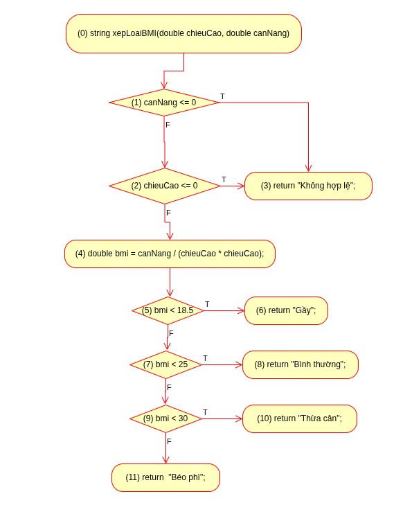
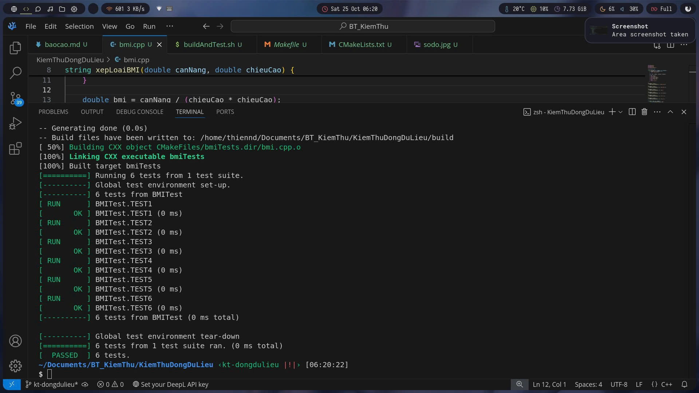

## Kiem thu BMI 

Từ đồ thị dòng điều khiển trên, ta xác định:
* ​ Với biến chieuCao:
    * ​def: 0
    * p-use: 2
    * c-use: 4
* Với biến canNang:
    * def: 0
    * p-use: 1
    * c-use: 4
* Với biến bmi:
    * def: 4
    * p-use: 5, 7, 9

## Ta có bảng sau

|  Variables |  Du-pair | Def-clear path  |      Complete path            |             Test case           |
|------------|----------|-----------------|-------------------------------|---------------------------------|
| chieuCao   | (0, 2T)  |  0, 1F, 2T      |  0, 1F, 2T, 3                 | chieuCao = 0  , canNang =  40   |
|            | (0, 2F)  |  0, 1F, 2F      |  0, 1F, 2F, 4, 5T, 6          | chieuCao = 1.7, canNang =  40   |
|            | (0, 4)   |  0, 1F, 2F, 4   |  0, 1F, 2F, 4, 5T, 6          | chieuCao = 1.7, canNang =  40   |
| canNang    | (0, 1T)  |  0, 1T          |  0, 1T, 3                     | chieuCao = 1.5, canNang =  0    |
|            | (0, 1F)  |  0, 1F          |  0, 1F, 2T, 3                 | chieuCao = 0  , canNang =  40   |
|            | (0, 4)   |  0, 1F, 2F, 4   |  0, 1F, 2F, 4, 5T, 6          | chieuCao = 1.7, canNang =  40   |
| bmi        | (4, 5T)  |  4, 5T          |  0, 1F, 2F, 4, 5T, 6          | chieuCao = 1.7, canNang =  40   |
|            | (4, 5F)  |  4, 5F          |  0, 1F, 2F, 4, 5F, 7T, 8      | chieuCao = 1.5, canNang =  50   |
|            | (4, 7T)  |  4, 5F, 7T      |  0, 1F, 2F, 4, 5F, 7T, 8      | chieuCao = 1.5, canNang =  50   |
|            | (4, 7F)  |  4, 5F, 7F      |  0, 1F, 2F, 4, 5F, 7F, 9T, 10 | chieuCao = 1.7, canNang =  85   |
|            | (4, 9T)  |  4, 5F, 7F, 9T  |  0, 1F, 2F, 4, 5F, 7F, 9T, 10 | chieuCao = 1.7, canNang =  85   |
|            | (4, 9F)  |  4, 5F, 7F, 9F  |  0, 1F, 2F, 4, 5F, 7F, 9T, 11 | chieuCao = 1.7, canNang =  87   |

## Test report:

| ID | canNang | chieuCao | Expected Output | Actual Output | Status  |
|----|----------|-----------|----------------|----------------|----------|
| 1  | 40       | 0         | Không hợp lệ   | Không hợp lệ   | PASSED   |
| 2  | 0        | 1.5       | Không hợp lệ   | Không hợp lệ   | PASSED   |
| 3  | 40       | 1.7       | Gầy            | Gầy            | PASSED   |
| 4  | 50       | 1.5       | Bình thường    | Bình thường    | PASSED   |
| 5  | 85       | 1.7       | Thừa cân       | Thừa cân       | PASSED   |
| 6  | 87       | 1.7       | Béo phì        | Béo phì        | PASSED   |

## Hình ảnh minh họa khi test với Gtest

